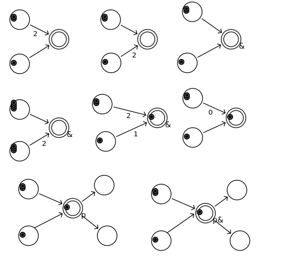
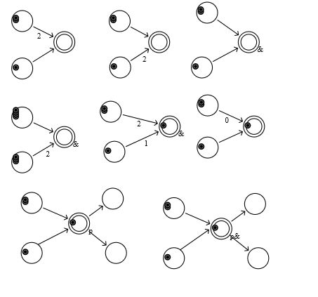

GameMechanics
=============

GameMechanics

## 5.1

* マキネーション
	* ゲーム内部経済の作成・シミュレーションのツール
	* www.jorisdormans.nl/machinations
	* 構文が決まっている
* ゲームプレイは有形・無形・抽象リソースの流れで決まる

* マキネーションダイアグラム
	* ノード
		* リソースをpull, push, 収集、配分する
	* リソースコネクション
		* リソースが要素間をどう移動するかを決める
	* ステートコネクション
		* リソース状況を調べてノードやリソースコネクションを変更する
		
		
# 5.6

* 演習1

